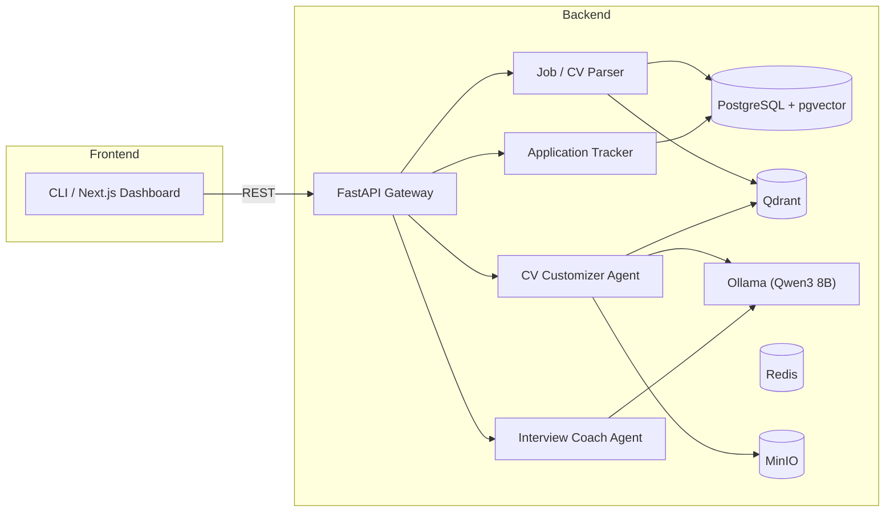

# Architecture Overview

## Goal

A self-contained, offline, local-first AI platform that helps a job seeker:
1. Parse and store job postings
2. Tailor a resume to each job
3. Generate interview-prep materials and run mock interviews
4. Track application status

All processing happens on the user's machine — no cloud APIs, no telemetry, no paid services.

## High-Level Architecture

## Monorepo Organization

The platform is a single repository with logically separated top-level folders:

| Folder | Role |
|--------|------|
| `backend/` | FastAPI app, agents, parsers, templates |
| `frontend/` | Next.js 16 web UI |
| `workers/` | Background job runners |
| `infrastructure/` | Dockerfiles, service configs |
| `scripts/` | Setup and dev helpers |
| `prompts/` | Versioned prompt templates (cv, interview, analysis) |
| `models/` | LLM/embedding configs, Ollama manifests |
| `docs/` | Architecture, ADRs, roadmap, data models, research |

Optional (later): `datasets/` (training/eval data), `browser-extension/` (one-click job save).

## Service Inventory

| Service | Tech | Purpose |
|---------|------|---------|
| backend | FastAPI + Uvicorn | REST API, agent orchestration |
| frontend | Next.js 16 | Web dashboard |
| postgres | PostgreSQL 16 + pgvector | Relational data + inline vectors |
| qdrant | Qdrant | Vector search for CV↔job matching |
| redis | Redis 7 | Cache + task queue backend |
| minio | MinIO | Object storage for uploaded files, PDFs |
| ollama | Ollama | Local LLM and embedding inference |

## Principles

- **Offline-only** — no external network calls from runtime paths
- **Privacy-first** — sensitive fields encrypted at rest; bind to localhost
- **Modular agents** — each agent is independently swappable
- **Permissive licenses only** — Apache 2.0, MIT, BSD
- **Reproducible** — prompt + model + version pinned per run

See `diagrams/architecture.md` for full mermaid diagrams and `adr/` for design decisions.
