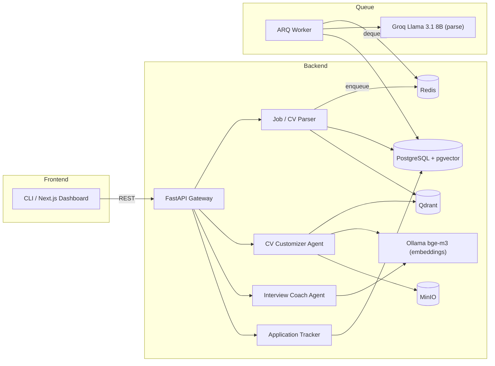

# Architecture Overview

## Goal

A privacy-respectful hybrid AI platform that helps a job seeker:
1. Parse and store job postings (cloud LLM — public data)
2. Tailor a resume to each job (local LLM — personal data)
3. Generate interview-prep materials and run mock interviews (local LLM)
4. Track application status

Parsing job posts uses a free cloud LLM (Groq) for speed and stability on limited hardware. Embeddings and personal-document agents use local Ollama. No telemetry, no paid services. See [ADR 0004](../adr/0004-cloud-llm-for-parsing.md) for the cloud LLM decision.

## High-Level Architecture

```mermaid
flowchart LR
    subgraph Frontend
      CLI["CLI / Next.js Dashboard"]
    end
    subgraph Backend
      API["FastAPI Gateway"]
      DB[(PostgreSQL + pgvector)]
      VDB[(Qdrant)]
      Embed["Ollama bge-m3 (embeddings)"]
      Cache[(Redis)]
      ObjectStore[(MinIO)]
      Parser["Job / CV Parser"]
      Customizer["CV Customizer Agent"]
      Interviewer["Interview Coach Agent"]
      Tracker["Application Tracker"]
    end
    subgraph Queue
      ARQ["ARQ Worker"]
      GroqLLM["Groq Llama 3.1 8B (parse)"]
    end
    CLI -->|REST| API
    API --> Parser
    API --> Customizer
    API --> Interviewer
    API --> Tracker
    Parser -->|enqueue| Cache
    ARQ -->|dequeue| Cache
    ARQ --> GroqLLM
    ARQ --> DB
    Parser --> DB
    Parser --> VDB
    Customizer --> VDB
    Customizer --> Embed
    Interviewer --> Embed
    Tracker --> DB
    Customizer --> ObjectStore
```

## Monorepo Organization

The platform is a single repository with logically separated top-level folders:

| Folder | Role |
|--------|------|
| `backend/` | FastAPI app, agents, parsers, templates, LLM provider |
| `frontend/` | Next.js 16 web UI |
| `workers/` | Background job runners (ARQ) |
| `infrastructure/` | Dockerfiles, service configs |
| `scripts/` | Setup and dev helpers |
| `prompts/` | Versioned prompt templates (cv, interview, analysis) |
| `models/` | LLM/embedding configs, Ollama manifests |
| `docs/` | Architecture, ADRs, roadmap, data models, research |

Optional (later): `datasets/` (training/eval data), `browser-extension/` (one-click job save).

## Service Inventory

| Service | Tech | Purpose |
|---------|------|---------|
| backend | FastAPI + Uvicorn | REST API, agent orchestration |
| worker | ARQ + Redis | Background job processing (parse dispatch, retries, self-heal) |
| frontend | Next.js 16 | Web dashboard |
| postgres | PostgreSQL 16 + pgvector | Relational data + inline vectors |
| qdrant | Qdrant | Vector search for CV↔job matching |
| redis | Redis 7 | Cache + ARQ task queue backend |
| minio | MinIO | Object storage for uploaded files, PDFs |
| ollama | Ollama | Local embedding inference (bge-m3); LLM fallback for personal-data agents |
| — | Groq | LLM inference for job-post parsing (Llama 3.1 8B, free tier) |

## Principles

- **Privacy-first (hybrid)** — Job-post text is public data, parsed via cloud LLM. Resumes, CVs, cover letters, and personal documents remain local-only.
- **Sensitive fields encrypted at rest** — bind to localhost.
- **Modular agents** — each agent is independently swappable.
- **Permissive licenses only** — Apache 2.0, MIT, BSD.
- **Reproducible** — prompt + model + version pinned per run.
- **No telemetry, no paid services** — Groq free tier is free for solo use.

See `diagrams/architecture.md` for full mermaid diagrams and `adr/` for design decisions.
