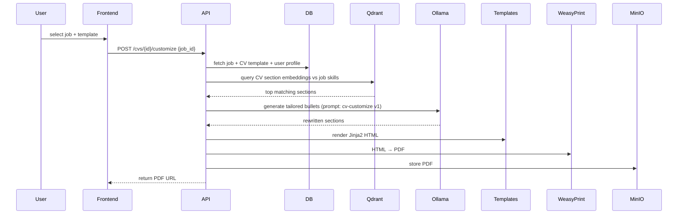
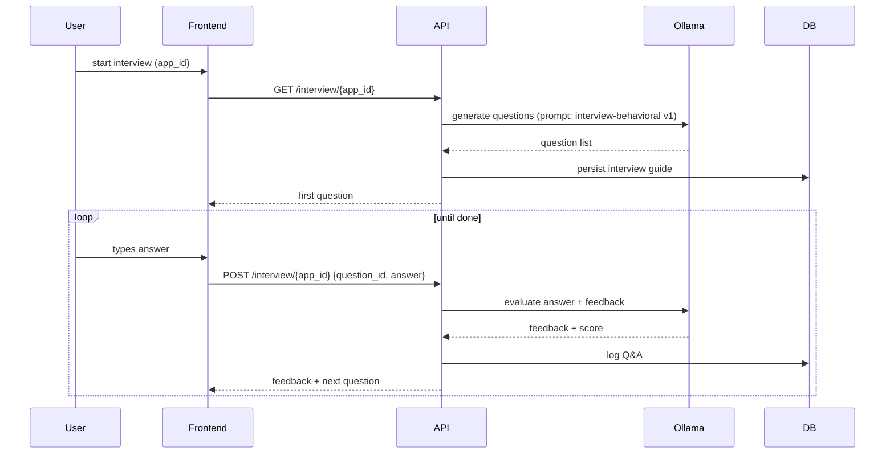

# System Design

## Backend Layers

The FastAPI backend follows a layered architecture:

```
api/routes/      → HTTP handlers (thin)
    ↓
services/        → orchestration, use cases
    ↓
repositories/    → data access (SQLAlchemy, Qdrant, MinIO)
    ↓
models/          → SQLAlchemy ORM entities
schemas/         → Pydantic request/response DTOs
```

Cross-cutting:
- `agents/` — LLM-backed agents (CV, Interview, Job Analyzer, etc.). Each agent has: prompt, tools, workflow, evaluation.
- `pipelines/` — multi-step data flows (e.g. extract → chunk → embed → store)
- `parsers/` — job posting and resume parsers (NLP + heuristics)
- `templates/` — Jinja2 HTML resume templates
- `embeddings/` — embedding generation and Qdrant collection management
- `interview/` — interview session state and feedback logic
- `tracker/` — application status and follow-up scheduling
- `analytics/` — aggregations for dashboard charts
- `scheduler/` — periodic jobs (daily scan, reminders)
- `workers/` — Celery/ARQ task definitions for background processing

## Agent Design

Each agent is a self-contained unit with:

| Aspect | Description |
|--------|-------------|
| memory | short-term session + long-term Qdrant-backed memory |
| tools | functions the agent can call (DB lookups, vector search, file IO) |
| prompt | loaded from `prompts/` folder by name + version |
| workflow | LangGraph state machine for multi-step reasoning |
| evaluation | metrics for output quality (similarity, ATS score, etc.) |

Planned agents:
1. CV Agent (resume optimization, ATS, keyword tuning)
2. Job Analyzer Agent
3. Cover Letter Agent
4. Interview Coach Agent
5. Company Research Agent
6. Application Tracker (service, not LLM-heavy)
7. Career Advisor Agent
8. Learning Planner Agent
9. Salary Negotiation Agent (later)
10. Mock Interview Agent
11. Skill Gap Agent

## Data Flow: CV Customization



## Data Flow: Mock Interview



## Security Boundaries

- All services bind to `127.0.0.1` by default (Docker network for inter-service)
- Sensitive fields (personal contact info) encrypted at rest via app-level encryption key
- File permissions `600` on resume files and DB dumps
- No outbound network from runtime paths (Docker network policy can enforce this later)
