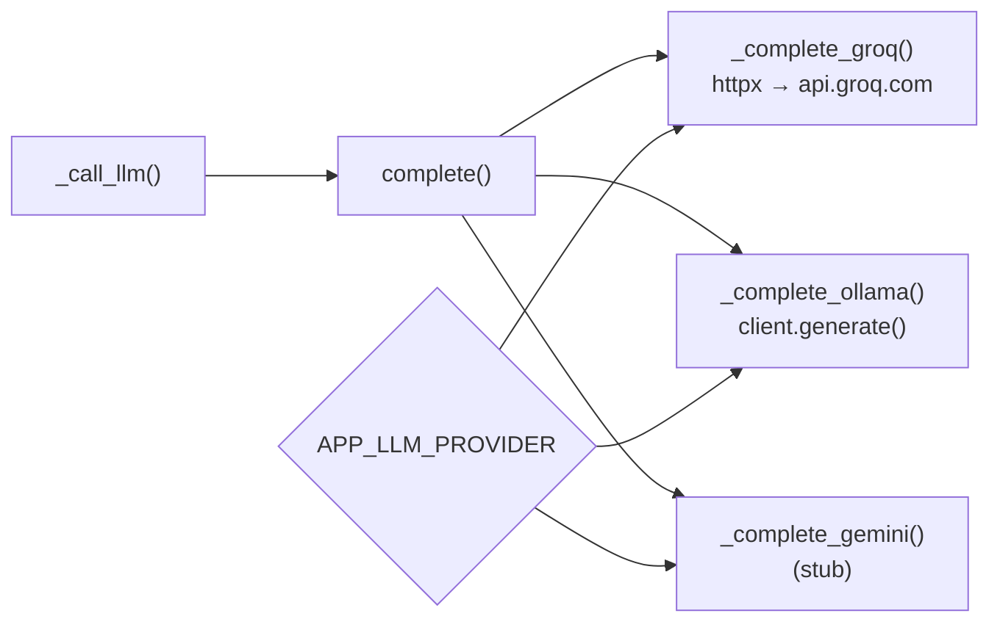
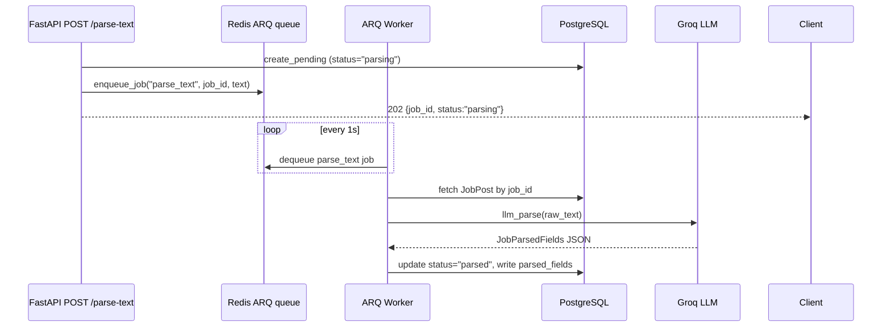
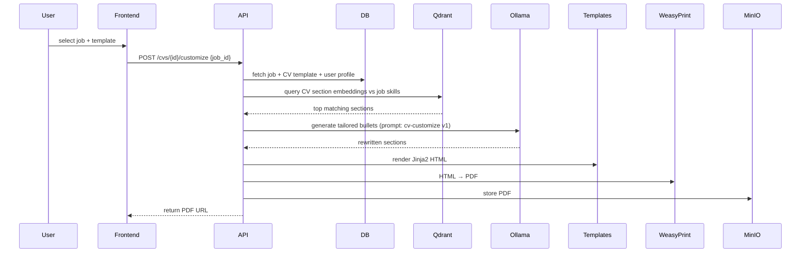
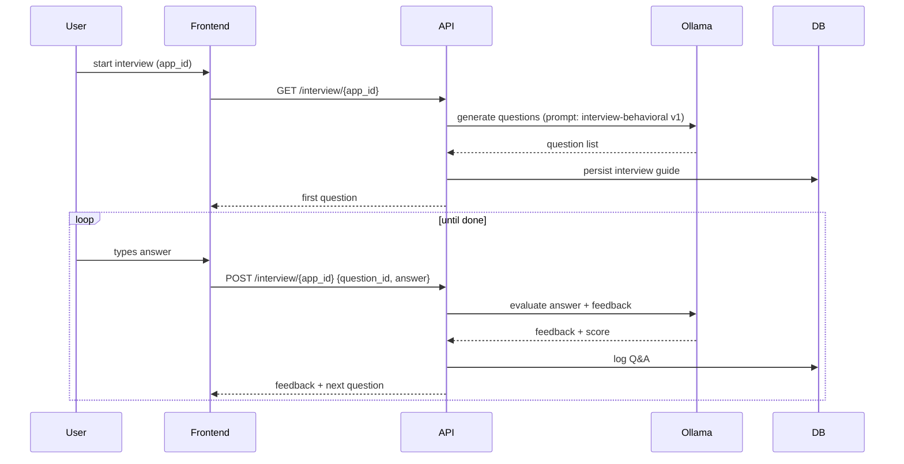

# System Design

## Backend Layers

The FastAPI backend follows a layered architecture:

```
api/routes/      → HTTP handlers (thin)
    ↓
services/        → orchestration, use cases
    ↓
repositories/    → data access (SQLAlchemy, Qdrant, MinIO)
    ↓
models/          → SQLAlchemy ORM entities
schemas/         → Pydantic request/response DTOs
```

Cross-cutting:
- `parsers/llm_provider.py` — **LLM provider abstraction layer**. Dispatches `complete()` calls to Groq, Ollama, or Gemini based on `APP_LLM_PROVIDER`. Groq uses OpenAI-compatible `httpx` calls with `response_format={"type":"json_object"}`; Ollama uses `AsyncClient.generate` with `format="json"`.
- `agents/` — LLM-backed agents (CV, Interview, Job Analyzer, etc.). Each agent has: prompt, tools, workflow, evaluation.
- `pipelines/` — multi-step data flows (e.g. extract → chunk → embed → store)
- `parsers/` — job posting and resume parsers (LLM + regex extraction)
- `templates/` — Jinja2 HTML resume templates
- `embeddings/` — embedding generation and Qdrant collection management
- `interview/` — interview session state and feedback logic
- `tracker/` — application status and follow-up scheduling
- `analytics/` — aggregations for dashboard charts
- `scheduler/` — periodic jobs (daily scan, reminders)
- `workers/` — **ARQ task definitions** for background job processing

## LLM Provider Layer

`backend/parsers/llm_provider.py` provides a single async entry point:

```python
async def complete(prompt, *, json_mode, max_tokens, temperature) -> str:
```


```mermaid
flowchart LR
    Caller["_call_llm()"] --> complete["complete()"]
    complete --> Groq["_complete_groq()\nhttpx → api.groq.com"]
    complete --> Ollama["_complete_ollama()\nclient.generate()"]
    complete --> Gemini["_complete_gemini()\n(stub)"]
    select{"APP_LLM_PROVIDER"} --> Groq
    select --> Ollama
    select --> Gemini
```

- `groq` (default): POST `https://api.groq.com/openai/v1/chat/completions` with `response_format={"type":"json_object"}`. Header: `Authorization: Bearer {APP_GROQ_API_KEY}`. Zero new SDK deps — uses existing `httpx`.
- `ollama` (fallback): `AsyncClient.generate(model, prompt, options)`. `format="json"` for structured output.
- `gemini` (stub): raises `NotImplementedError`.

Configuration via `backend/core/config.py`:
```python
llm_provider: str = "groq"
llm_model: str = "llama-3.1-8b-instant"
groq_api_key: str | None = None
llm_timeout_seconds: float = 30.0
llm_temperature: float = 0.1
llm_max_tokens: int = 1024
llm_max_text_chars: int = 6000
```

## Background Job Worker (ARQ)

Job parsing uses **ARQ** (async Redis queue) instead of in-process `asyncio.create_task`. The flow:


```mermaid
sequenceDiagram
    participant API as FastAPI POST /parse-text
    participant Redis as Redis ARQ queue
    participant Worker as ARQ Worker
    participant DB as PostgreSQL
    participant Groq as Groq LLM

    API->>DB: create_pending (status="parsing")
    API->>Redis: enqueue_job("parse_text", job_id, text)
    API-->>Client: 202 {job_id, status:"parsing"}

    loop every 1s
        Worker->>Redis: dequeue parse_text job
    end
    Worker->>DB: fetch JobPost by job_id
    Worker->>Groq: llm_parse(raw_text)
    Groq-->>Worker: JobParsedFields JSON
    Worker->>DB: update status="parsed", write parsed_fields
```

Key details:
- **Worker settings** (`backend/workers/arq_worker.py`): `max_jobs=3`, `max_tries=3`, `poll_delay=1.0`, `keep_result=3600`. Redis connection via `RedisSettings.from_dsn(settings.redis_url)`.
- **PDF handling**: PDF extraction (`ExtractionService.extract`) runs **inline in the route** (fast, local). The extracted text is then enqueued as a `parse_text` task — no large binary payloads in the queue.
- **URL handling**: URL fetching (`httpx` + Playwright fallback) runs inside the worker task, then results passed to `llm_parse`.
- **Worker process**: Runs as a separate process (`arq workers.arq_worker.WorkerSettings`), started by `scripts/dev.ps1` or `docker compose` worker service. Not affected by uvicorn `--reload` restarts.
- **Redis pool**: Singleton `ArqRedis` initialized lazily (`workers/redis_pool.py`), closed on FastAPI shutdown via `main.py` lifespan.

## Stale Job Sweeper

`backend/main.py` lifespan includes a startup sweeper (`_sweep_stale_parsing_jobs`):

- Every backend boot: query `JobPost` rows with `status="parsing"` and `updated_at` older than 5 minutes.
- Mark them `status="failed"` with an error message ("Stranded parse — backend restarted while job was parsing").
- Rows older than 1 hour get a separate "definitively timed out" error.
- Prevents permanently stranded rows after a crash or restart.

## Agent Design

Each agent is a self-contained unit with:

| Aspect | Description |
|--------|-------------|
| memory | short-term session + long-term Qdrant-backed memory |
| tools | functions the agent can call (DB lookups, vector search, file IO) |
| prompt | loaded from `prompts/` folder by name + version |
| workflow | LangGraph state machine for multi-step reasoning |
| evaluation | metrics for output quality (similarity, ATS score, etc.) |

Planned agents:
1. CV Agent (resume optimization, ATS, keyword tuning)
2. Job Analyzer Agent
3. Cover Letter Agent
4. Interview Coach Agent
5. Company Research Agent
6. Application Tracker (service, not LLM-heavy)
7. Career Advisor Agent
8. Learning Planner Agent
9. Salary Negotiation Agent (later)
10. Mock Interview Agent
11. Skill Gap Agent

## Data Flow: CV Customization


```mermaid
sequenceDiagram
    User->>Frontend: select job + template
    Frontend->>API: POST /cvs/{id}/customize {job_id}
    API->>DB: fetch job + CV template + user profile
    API->>Qdrant: query CV section embeddings vs job skills
    Qdrant-->>API: top matching sections
    API->>Ollama: generate tailored bullets (prompt: cv-customize v1)
    Ollama-->>API: rewritten sections
    API->>Templates: render Jinja2 HTML
    API->>WeasyPrint: HTML → PDF
    API->>MinIO: store PDF
    API-->>Frontend: return PDF URL
```

## Data Flow: Mock Interview


```mermaid
sequenceDiagram
    User->>Frontend: start interview (app_id)
    Frontend->>API: GET /interview/{app_id}
    API->>Ollama: generate questions (prompt: interview-behavioral v1)
    Ollama-->>API: question list
    API->>DB: persist interview guide
    API-->>Frontend: first question
    loop until done
        User->>Frontend: types answer
        Frontend->>API: POST /interview/{app_id} {question_id, answer}
        API->>Ollama: evaluate answer + feedback
        Ollama-->>API: feedback + score
        API->>DB: log Q&A
        API-->>Frontend: feedback + next question
    end
```

## Security Boundaries

- Job-post parsing (public data) may use cloud LLM (Groq). All personal-data paths (resume, CV, cover letter, interview) remain local via Ollama by default.
- All services bind to `127.0.0.1` by default (Docker network for inter-service)
- Sensitive fields (personal contact info) encrypted at rest via app-level encryption key
- File permissions `600` on resume files and DB dumps
- Docker containers carry hard memory limits (`deploy.resources.limits.memory`) to prevent WSL2 OOM
