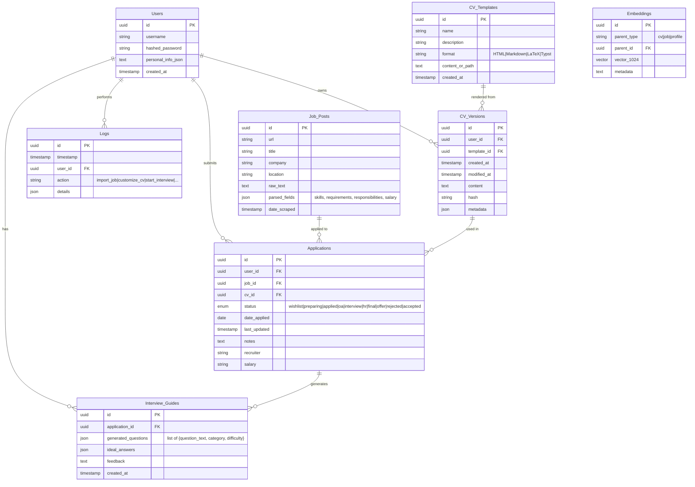

# Data Models / ER Diagram

## Entity-Relationship Diagram

## Storage Strategy

| Data | Store | Reason |
|------|-------|--------|
| Relational entities (Users, Jobs, Applications, etc.) | PostgreSQL | ACID, joins, structured queries |
| Inline vectors (small collections, profile embeddings) | pgvector | Collocated with relational data |
| Large-scale vector search (CV sections, job corpus) | Qdrant | Specialized performance, filtering |
| Raw uploaded files (PDFs, CVs, certificates) | MinIO | Object storage with versioning |
| Cache + task queue | Redis | Fast ephemeral storage, Celery/ARQ broker |
| Prompt templates | `prompts/` folder (filesystem) | Version-controlled, decoupled |

## Notes

- `parsed_fields` on `Job_Posts` is JSON to accommodate varying job-post structures.
- `CV_Versions` keeps a hash for deduplication and a full history (never overwrite).
- `Embeddings.parent_id` is a polymorphic FK — enforce via application logic, not DB constraint.
- `Interview_Guides.generated_questions` stores the full Q&A transcript after a mock interview.
- Sensitive fields (e.g. personal contact info) should be encrypted at the application layer using `APP_ENCRYPTION_KEY`.
