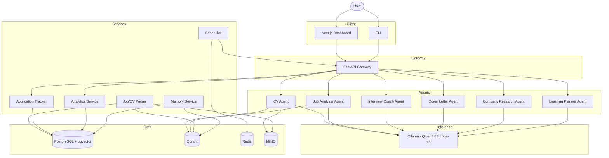
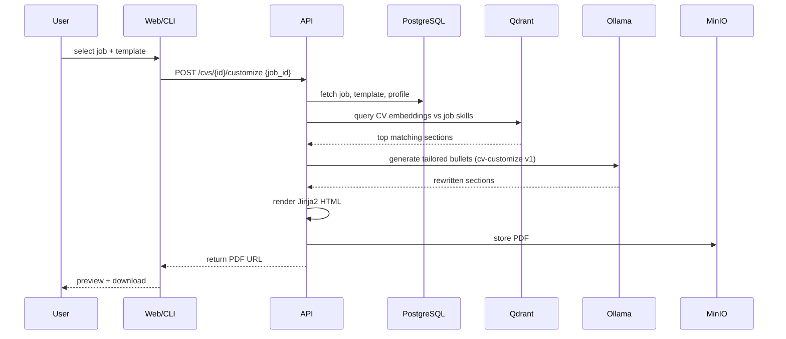
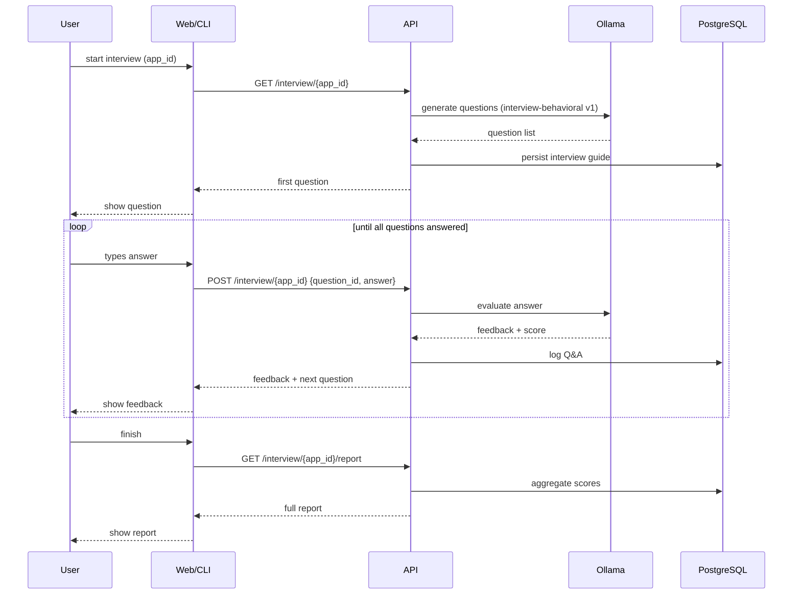
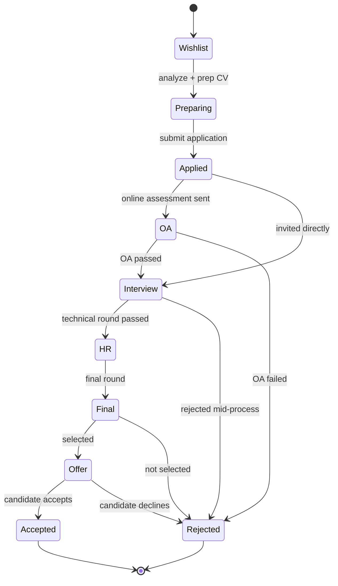

# Architecture Diagrams

## System Architecture

```mermaid
flowchart TB
    User([User])

    subgraph Client
      Web[Next.js Dashboard]
      CLI[CLI]
    end

    subgraph Gateway
      API[FastAPI Gateway]
    end

    subgraph Agents
      CVAgent[CV Agent]
      JobAgent[Job Analyzer Agent]
      IntAgent[Interview Coach Agent]
      CoverAgent[Cover Letter Agent]
      CompanyAgent[Company Research Agent]
      LearnAgent[Learning Planner Agent]
    end

    subgraph Services
      Parser[Job/CV Parser]
      Tracker[Application Tracker]
      Analytics[Analytics Service]
      Memory[Memory Service]
      Scheduler[Scheduler]
    end

    subgraph Data
      PG[(PostgreSQL + pgvector)]
      Qdrant[(Qdrant)]
      Redis[(Redis)]
      MinIO[(MinIO)]
    end

    subgraph Inference
      Ollama[Ollama - Qwen3 8B / bge-m3]
    end

    User --> Web
    User --> CLI
    Web --> API
    CLI --> API
    API --> CVAgent
    API --> JobAgent
    API --> IntAgent
    API --> CoverAgent
    API --> CompanyAgent
    API --> LearnAgent
    API --> Tracker
    API --> Analytics

    CVAgent --> Qdrant
    CVAgent --> Ollama
    JobAgent --> Qdrant
    JobAgent --> Ollama
    IntAgent --> Ollama
    CoverAgent --> Ollama
    CompanyAgent --> Ollama
    LearnAgent --> Ollama

    Parser --> PG
    Parser --> Qdrant
    Tracker --> PG
    Analytics --> PG
    Memory --> Qdrant
    Memory --> PG
    Scheduler --> Redis
    Scheduler --> API

    CVAgent --> MinIO
    Parser --> MinIO
```

## CV Customization Sequence

```mermaid
sequenceDiagram
    participant U as User
    participant W as Web/CLI
    participant A as API
    participant DB as PostgreSQL
    participant V as Qdrant
    participant L as Ollama
    participant M as MinIO

    U->>W: select job + template
    W->>A: POST /cvs/{id}/customize {job_id}
    A->>DB: fetch job, template, profile
    A->>V: query CV embeddings vs job skills
    V-->>A: top matching sections
    A->>L: generate tailored bullets (cv-customize v1)
    L-->>A: rewritten sections
    A->>A: render Jinja2 HTML
    A->>M: store PDF
    A-->>W: return PDF URL
    W-->>U: preview + download
```

## Mock Interview Sequence

```mermaid
sequenceDiagram
    participant U as User
    participant W as Web/CLI
    participant A as API
    participant L as Ollama
    participant DB as PostgreSQL

    U->>W: start interview (app_id)
    W->>A: GET /interview/{app_id}
    A->>L: generate questions (interview-behavioral v1)
    L-->>A: question list
    A->>DB: persist interview guide
    A-->>W: first question
    W-->>U: show question

    loop until all questions answered
        U->>W: types answer
        W->>A: POST /interview/{app_id} {question_id, answer}
        A->>L: evaluate answer
        L-->>A: feedback + score
        A->>DB: log Q&A
        A-->>W: feedback + next question
        W-->>U: show feedback
    end

    U->>W: finish
    W->>A: GET /interview/{app_id}/report
    A->>DB: aggregate scores
    A-->>W: full report
    W-->>U: show report
```

## Application Tracker State Machine

```mermaid
stateDiagram-v2
    [*] --> Wishlist
    Wishlist --> Preparing: analyze + prep CV
    Preparing --> Applied: submit application
    Applied --> OA: online assessment sent
    Applied --> Interview: invited directly
    OA --> Interview: OA passed
    OA --> Rejected: OA failed
    Interview --> HR: technical round passed
    HR --> Final: final round
    Final --> Offer: selected
    Final --> Rejected: not selected
    Offer --> Accepted: candidate accepts
    Offer --> Rejected: candidate declines
    Interview --> Rejected: rejected mid-process
    Accepted --> [*]
    Rejected --> [*]
```
