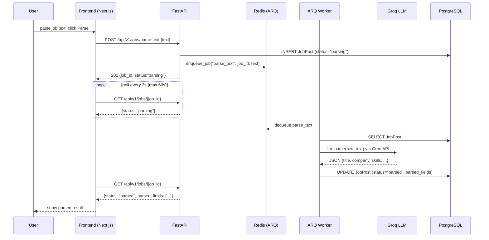
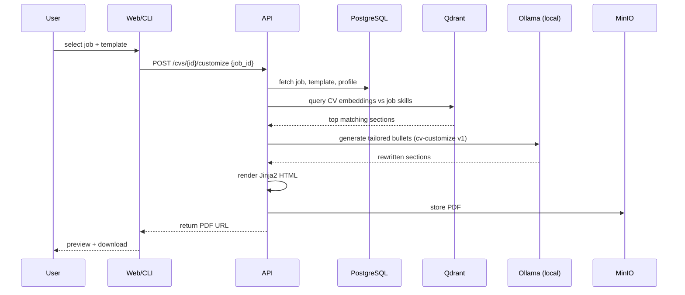
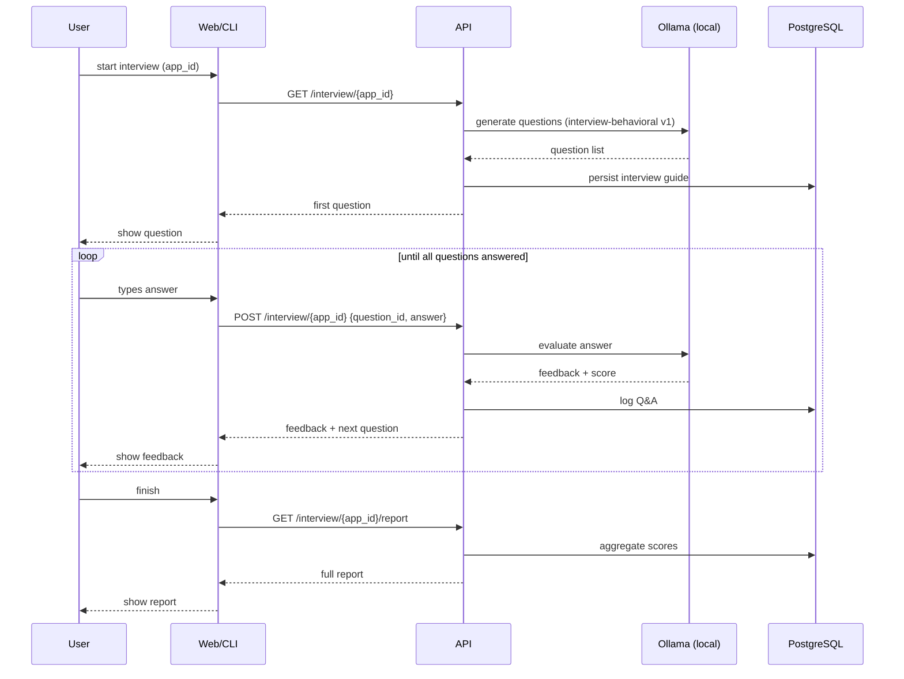
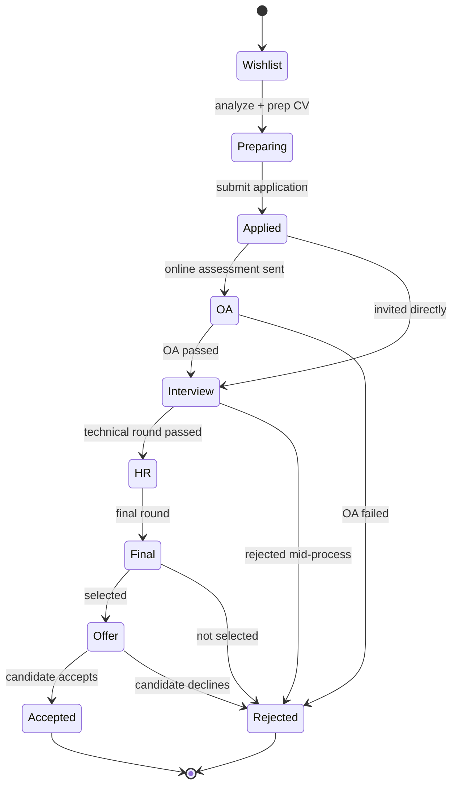

# Architecture Diagrams

## System Architecture

```mermaid
flowchart TB
    User([User])

    subgraph Client
      Web[Next.js Dashboard]
      CLI[CLI]
    end

    subgraph Gateway
      API[FastAPI Gateway]
    end

    subgraph Queue
      ARQWorker[ARQ Worker]
      RedisQ[(Redis ARQ queue)]
    end

    subgraph Agents
      CVAgent[CV Agent]
      JobAgent[Job Analyzer Agent]
      IntAgent[Interview Coach Agent]
      CoverAgent[Cover Letter Agent]
      CompanyAgent[Company Research Agent]
      LearnAgent[Learning Planner Agent]
    end

    subgraph Services
      Parser[Job/CV Parser]
      Tracker[Application Tracker]
      Analytics[Analytics Service]
      Memory[Memory Service]
      Scheduler[Scheduler]
    end

    subgraph Data
      PG[(PostgreSQL + pgvector)]
      Qdrant[(Qdrant)]
      MinIO[(MinIO)]
    end

    subgraph Inference
      GroqLLM[Groq - Llama 3.1 8B (parse)]
      OllamaEmb[Ollama - bge-m3 (embeddings)]
    end

    User --> Web
    User --> CLI
    Web --> API
    CLI --> API

    API -->|enqueue parse| RedisQ
    ARQWorker -->|dequeue| RedisQ
    ARQWorker --> GroqLLM
    ARQWorker --> PG

    API --> CVAgent
    API --> JobAgent
    API --> IntAgent
    API --> CoverAgent
    API --> CompanyAgent
    API --> LearnAgent
    API --> Tracker
    API --> Analytics

    CVAgent --> Qdrant
    CVAgent --> OllamaEmb
    JobAgent --> Qdrant
    JobAgent --> OllamaEmb
    IntAgent --> OllamaEmb
    CoverAgent --> OllamaEmb
    CompanyAgent --> OllamaEmb
    LearnAgent --> OllamaEmb

    Parser --> PG
    Parser --> Qdrant
    Tracker --> PG
    Analytics --> PG
    Memory --> Qdrant
    Memory --> PG
    Scheduler --> RedisQ
    Scheduler --> API

    CVAgent --> MinIO
    Parser --> MinIO
```

## Job Parsing Sequence (Phase 3 — ARQ + Groq)



## CV Customization Sequence



## Mock Interview Sequence



## Application Tracker State Machine


