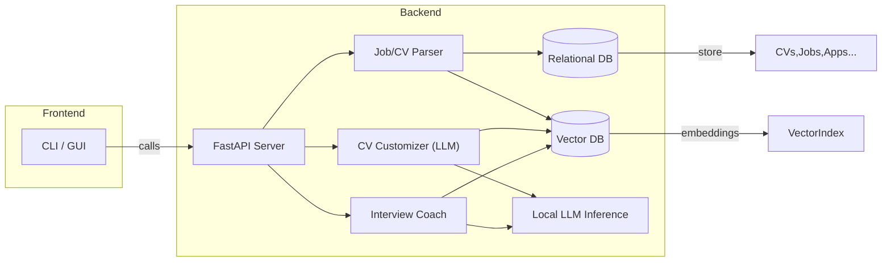
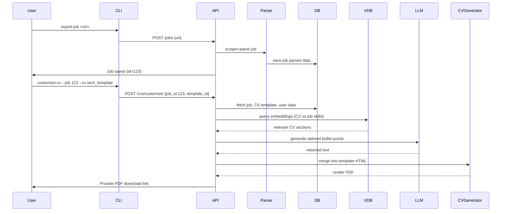

# Executive Summary  
We propose a self-contained **personalized job-application agent** that runs entirely offline on the user’s machine using open-source components. It will ingest job descriptions (via pasted text or scraped links), parse and store them in a database, and then customize the user’s résumé (CV) templates to each job. It will also generate interview-prep materials (practice questions, mock interview sessions, feedback) and track application status (dates, company, status). The entire pipeline—from NLP parsing, embedding search, and LLM prompting to PDF generation—is implemented with free, local libraries. By leveraging local LLMs (e.g. Qwen3, Mistral, Phi-4-mini) under permissive licenses, vector databases (e.g. Weaviate, Qdrant, pgvector), and PDF/HTML toolkits (e.g. WeasyPrint, wkhtmltopdf), we ensure privacy, no cloud dependencies, and offline operation. The architecture is modular and Dockerized, enabling easy development and scaling.  

# Goals and User Stories  
**Goals:** Build an offline assistant that:  
- Parses and stores job postings (from links or text), extracting key requirements and skills.  
- Stores multiple CV templates and user profiles (experience, skills, education) in a structured way.  
- **Customizes a CV for each job** by highlighting relevant skills/experience and rephrasing sections via prompt-driven generation.  
- **Guides interview prep** by generating likely interview questions (technical and behavioral) based on the job and tailored résumé. Conducts mock interviews (question/answer) and provides feedback.  
- Tracks all applications with status updates, follow-up reminders, and logs (e.g. applications table with company, role, date applied, status).  

**User Stories:**  
- *As a job seeker*, I want to input a job posting (URL or description) and have my résumé automatically re-tailored to emphasize the job’s requirements, so I can quickly submit a strong application.  
- *As a job seeker*, I want the system to generate a list of potential interview questions for that role (coding, design, behavioral), and practice answering them interactively, receiving feedback on my answers.  
- *As a job seeker*, I want to keep track of all jobs I’ve applied to (company, role, date, status) in one place, so I don’t lose track of opportunities.  

# Functional Requirements  
- **Job Ingestion:** Ability to create job entries by pasting text or scraping a job URL. Extract structured data (title, company, requirements, skills, salary, location).  
- **CV Management:** Support multiple CV templates (e.g. technical, managerial) in PDF or Markdown format. Store user data (personal info, work history, skills). Provide a way to select a template and fill fields.  
- **CV Customization:** Given a job’s key requirements, emphasize matching skills/experiences by generating or reordering content. Possibly use embeddings or semantic search to match CV bullet points to job requirements, and LLM prompting to rewrite summaries or descriptions. Output a printable CV (PDF).  
- **Interview Prep:** Generate likely interview questions from the job description and CV. Provide interactive Q&A (“mock interview”): user types answers, the system evaluates or gives hints (via another LLM call). Focus on behavioral (STAR method) and technical topics derived from the job’s tech stack.  
- **Application Tracker:** Store each application (CV version used, job applied, date, status: e.g. Applied, Interviewing, Offer, Rejected). Allow status updates and notes. Show a dashboard or CLI listing for pending tasks.  
- **Data Storage:** Persist all data locally in structured form (e.g. relational DB). Manage CV templates as files or stored text.  
- **User Interface:** Provide a CLI and optionally a simple GUI (web or desktop) to trigger actions (import job, customize CV, run interview simulation, update status).  

# Non-Functional Requirements  
- **Offline & Local:** Must run entirely on the user’s machine without external calls. No cloud APIs or paid services. All models and data stay on-device for privacy.  
- **Security & Privacy:** All data (CV content, job info, logs) is stored locally. Sensitive information (e.g. user personal info) should be encrypted at rest (e.g. encrypting database or using encrypted volumes). Access can be protected by local user authentication if multiple users, or rely on OS permissions.  
- **Performance:** Interactive response (< 1-2s per action where possible). Use lightweight quantized LLMs (e.g. Phi-4-mini 3.8B or Qwen3 8B) for fast inference on consumer GPUs/CPUs. Cache embeddings in a vector store for fast similarity search.  
- **Scalability:** Designed as microservices so components (CV generator, job scraper, interview coach, database) can scale or be extended. For a single user machine, scale is modest (hundreds of jobs, few CVs), but design should allow swapping components (e.g. a more powerful GPU or larger LLM).  
- **Modularity:** Separate services for CV processing, job parsing, tracking, etc., communicating via APIs. This allows replacing, for example, the NLP parser or LLM model without rewriting the entire system.  
- **Maintainability:** Use containerization (Docker) and CI/CD to rebuild, test, and deploy updates easily.  
- **Reliability:** Data backups (e.g. periodic DB dump or volume snapshot) should be straightforward. The system must recover gracefully if interrupted (e.g. mid-generation).  
- **Compliance:** Use only permissively licensed components (Apache 2.0, MIT, BSD) so there are no restrictions on commercial or personal use. Avoid GPL if it conflicts with bundling in closed products.  

# Data Models  

Design relational tables (e.g. PostgreSQL or SQLite) for core entities:  

- **Users (if multi-user support):** id, username, hashed_password (or rely on OS user) etc.  
- **CV_Templates:** id, name, description, format (HTML/Markdown), content or file path.  
- **CV_Versions:** id, user_id, template_id, created_at, modified_at, **content** (or link to stored PDF) and metadata (hash, last_modified). Each row is a filled CV. Fields: personal info, skills, experiences as JSON or text.  
- **Job_Posts:** id, url (if scraped), title, company, location, raw_text, parsed_fields (JSON: skills, requirements, responsibilities), date_scraped.  
- **Applications:** id, user_id, job_id (FK to Job_Posts), cv_id (FK to CV_Versions used), status (enum: Applied, Interviewing, Offer, Rejected, etc.), date_applied, last_updated, notes (text).  
- **Interview_Guides:** id, application_id (FK), generated_questions (JSON list with fields: question_text, category), ideal_answers (optional), feedback (text).  
- **Embeddings:** id, parent_id (generic FK to CV or Job), vector (float[] or stored in vector DB), metadata (text). Actually store embeddings in a vector database (Qdrant/Weaviate) rather than SQL.  
- **Logs / Events:** id, timestamp, user_id, action (e.g. “import_job”, “customize_cv”, “start_interview”), details (text/JSON).  

Each table’s fields should capture necessary data. For example, the Job_Posts table can include a JSON field with extracted sections (requirements, preferred skills, etc.) for easier access. The Interviews table stores question/answer pairs or transcripts.  

# Tech Stack Recommendations  

- **OS & Container:** Target a Linux environment (Ubuntu or Alpine) inside Docker containers for portability. Each service runs in its own container. Docker Compose (or Kubernetes) orchestrates services.  
- **Language:** Python 3.10+ for backend and NLP (rich libraries). For performance-critical parts (vector search), we rely on external tools (vector DB). Front-end CLI in Python (Click/Typer) or a lightweight web UI (Streamlit, Flask/React). All are open-source.  
- **Web/CLI Framework:** [FastAPI](https://fastapi.tiangolo.com/) (ASGI Python) for REST APIs (very active, async, supports OpenAPI). For CLI, [Typer](https://typer.tiangolo.com/) or [Click](https://click.palletsprojects.com/) (mit license) works well. GUI could use [Streamlit](https://streamlit.io) (BSD) or a minimal Electron/React if a desktop app is desired.  
- **Local LLMs:** According to 2026 benchmarks, models like **Qwen3** (Apache 2.0), **Mistral Small 3.1** (Apache 2.0), **Devstral** (Apache 2.0) or **Phi-4-mini** (MIT) provide a good balance of quality and license. These can run on modern laptops/PCs. We can load them via HuggingFace transformers or use optimized runtimes (e.g. `llama.cpp`, [text-generation-webui](https://github.com/oobabooga/text-generation-webui) or [LocalAI](https://github.com/go-skynet/LocalAI) servers).  
- **Prompting/LLM Framework:** Use [LangChain](https://langchain.com/) or [Haystack](https://haystack.deepset.ai/) for orchestrating prompts and RAG workflows (they are open-source). For prompt templates and chaining. Alternatively, use plain Transformers pipeline with custom prompts.  
- **Vector Database:** For offline vector search, consider **Qdrant** (open-source, Rust-based), **Weaviate** (open-source, BSD), or **PostgreSQL + pgvector** (MIT license). Qdrant and Weaviate have Docker images and REST APIs and handle JSON metadata filtering, which is helpful for RAG. **Milvus** (Apache 2.0) is another option but is heavier. Weaviate even has built-in text embedding modules. Using a vector DB lets us store embeddings of past applications, CV sections, and job requirements for fast similarity search.  
- **PDF/Template Engine:** Use **WeasyPrint** (BSD, Python) or **wkhtmltopdf** (LGPLv3) to generate PDF from HTML/CSS templates. These let you style a CV with CSS and output high-quality PDF. As an alternative, **ReportLab** (BSD) or **FPDF** (MIT) could be used to programmatically generate PDFs, but HTML/CSS offers more design flexibility. For templating the CV content, use **Jinja2** (BSD) with HTML/CSS templates, then convert.  
- **OCR/Text Extraction:** To parse existing PDF resumes or job PDFs, use **Apache Tika** (Apache 2.0) or **pdfplumber/pdfminer** (MIT) to extract text. For images, **Tesseract OCR** (Apache 2.0) can be used.  
- **Resume Parsing/NLP:** Use an NLP library like **spaCy** (MIT) or **HuggingFace Transformers** to do named-entity recognition for people/organizations, as well as custom rules for dates/education. There are open-source projects like [pyresparser](https://github.com/bendaniel10/pyresparser) (MIT) or [resume-parser](https://github.com/mayooear/gptw/tree/main/resume-parser) that can be adapted. If using an LLM, one could also use it as a parser via prompts.  
- **Web Scraping:** For extracting job posts from URLs, use **requests** (Apache-2) + **BeautifulSoup** (MIT) for static pages. If dynamic content is needed (modern job sites), use **Playwright** or **Puppeteer** (both MIT) to render. **Scrapy** (BSD) is another option for structured scraping.  
- **Database:** Use **PostgreSQL** (open source) or **SQLite** (public domain) for relational storage. PostgreSQL + pgvector is a powerful combo for storing JSON fields and vectors. SQLite is lighter for a single-user desktop tool, but harder to scale.  

*Alternatives & Licenses:* All above components have permissive or compatible licenses. For example, Qdrant is Apache 2.0, Weaviate BSD, wkhtmltopdf LGPL, WeasyPrint BSD, spaCy MIT, HuggingFace/Transformers Apache 2.0, LangChain MIT, FastAPI MIT, etc. Closed-source or paid options (OpenAI API, Pinecone, etc.) are avoided.

# Architecture  

We will adopt a **microservices-inspired modular architecture** deployed via Docker. A **FastAPI** backend (Python) exposes REST endpoints. Key internal components: Job Parser, CV Generator, Interview Coach, Application Tracker. All share a common database and possibly a message broker. The LLM and vector-search capabilities can be provided by separate services or as part of the backend.



Each service is a Docker container. For example, the **vector DB container** (Qdrant) stores embeddings of CVs and job postings. The **FastAPI app container** holds the Python code for parsing and orchestration; it can load models via `transformers` or call a local inference server. The **CLI/GUI** runs locally (could be the same container or separate UI container).  

We ensure **industry best practices**: separation of concerns, containerization, logging and monitoring, health checks. For container orchestration on a single machine, Docker Compose suffices; for a larger deployment, we could use Kubernetes (though offline, K8s might be overkill unless multi-node).

# Deployment Plan (Docker)  

A sample **docker-compose.yml** might include:  
```yaml
services:
  backend:
    build: ./backend
    image: jobagent-backend:latest
    depends_on:
      - db
      - vector-db
    ports:
      - "8000:8000"
    volumes:
      - ./templates:/app/templates
      - ./data:/app/data
  db:
    image: postgres:15
    environment:
      POSTGRES_USER: agent
      POSTGRES_PASSWORD: secret
    volumes:
      - pgdata:/var/lib/postgresql/data
  vector-db:
    image: qdrant/qdrant:latest
    ports:
      - "6333:6333"
    volumes:
      - qdrantdata:/qdrant/storage
volumes:
  pgdata:
  qdrantdata:
```
Here the **backend** container runs FastAPI and loads models. **PostgreSQL** persists with a volume. **Qdrant** runs the vector index. In practice, we might also add a container for a Redis (cache) or message queue (RabbitMQ) if needed, but a single FastAPI process might suffice.  

For **Kubernetes notes**, each service (backend, db, vector) would be a Deployment with a PersistentVolume for storage. Use a ConfigMap/Secret for DB creds. Liveness/readiness probes ensure services are running.  

# API Design & CLI/GUI  

We expose a RESTful API with endpoints such as:  

| Endpoint                  | Method | Description                                   | Input/Output      |
|---------------------------|--------|-----------------------------------------------|-------------------|
| `/jobs`                   | GET    | List all stored jobs                          | JSON list of jobs |
| `/jobs`                   | POST   | Add a job (URL or text)                       | Body: `{url, text}` ⇒ `{job_id}` |
| `/jobs/{id}`              | GET    | Get job details (parsed)                      | JSON job object   |
| `/cvs`                    | GET    | List available CV versions/templates          | JSON list         |
| `/cvs`                    | POST   | Create/parse a new CV from data               | Body: user data ⇒ `{cv_id}` |
| `/cvs/{id}/customize`     | POST   | Tailor CV to specific job                     | Body: `{job_id}` ⇒ new CV PDF |
| `/applications`           | GET    | List applications                             | JSON list         |
| `/applications`           | POST   | Add application (job_id, cv_id)               | Body: `{job_id, cv_id}` ⇒ `{app_id}` |
| `/applications/{id}`      | PUT    | Update status or notes of an application      | Body: `{status, notes}` |
| `/interview/{app_id}`     | GET    | Generate interview questions for application  | JSON Q&A list     |
| `/interview/{app_id}`     | POST   | Submit answer to question (mock interview)    | Body: `{question_id, answer}` ⇒ feedback |
| `/templates`              | GET/POST | List or create CV templates                | JSON or id        |
| `/log`                    | GET    | Retrieve event logs                           | JSON log entries  |

Each endpoint returns structured JSON (and PDF for the customize CV endpoint). Responses include success/error codes. Authentication could be via an API key or local file token for CLI, but since it’s local, we might skip auth and rely on file system security.  

**CLI options:** For example, using a `jobagent` CLI:  
- `jobagent import-job <url>` – Scrape/parse a job from URL.  
- `jobagent list-jobs` – Show stored jobs.  
- `jobagent customize-cv --job JOB_ID --cv TEMPLATE_ID` – Generate a tailored CV PDF.  
- `jobagent start-interview --app APP_ID` – Begin a mock interview for an application.  
- `jobagent list-apps` – Show tracked applications.  
- `jobagent update-app --app APP_ID --status "Interviewing"` – Update status.  

Optionally a web GUI (localhost) can mirror these actions with forms and buttons.  

# ML/NLP Pipeline  

1. **Resume Parsing:** Use NLP/ML to parse raw resumes (PDF or text). We can use spaCy or a small transformer NER model to extract entities (names, companies, dates). For complete extraction, we might fine-tune a model on labeled resumes (courses, positions, dates) or use rule-based regex for emails/phones. Open-source projects (e.g. *pyresparser*) can bootstrap this. The result populates the CV_Versions table with structured sections.  

2. **Job-Post Parsing:** Similar approach for job descriptions. After scraping text, apply NLP (spaCy or transformer) to segment sections (requirements, responsibilities). Identify keywords for skills and degrees. We may use custom classification or regex (e.g. list under "Requirements:"). NER can tag company names and locations. 

3. **Embedding & Matching:** Embed both CV content and job descriptions using a sentence-transformer or the same LLM encoder. Store these embeddings in the vector DB. To customize a CV, retrieve top-matching sentences or bullet points from the user’s CV that align with the job’s requirements (via nearest-neighbor search).  

4. **Prompt Engineering (CV Customization):** Given the retrieved relevant CV content and job keywords, craft a prompt to the LLM such as:  
   *“Rewrite the following work experience bullet points to highlight [skillX, skillY] for a [Job Title] position at [Company]. Original text: […]”*  
   The LLM (e.g. Qwen3 or Devstral) outputs refined sentences. Similar prompts can summarize achievements in one or two lines. The system can iterate to optimize the match.  

5. **Prompt Engineering (Interview Qs):** Use prompts like:  
   *“Generate 5 technical interview questions (with answers) relevant for a [Job Title] position requiring [skill list] and [tools].”*  
   And similarly for behavioral:  
   *“List common behavioral interview questions for this role focusing on teamwork and problem-solving.”*  
   The LLM or a fine-tuned assistant model generates question-answer pairs.  

6. **Mock Interview & Feedback:** The backend presents one question at a time (CLI or UI). The user types an answer. The system either compares it (embedding similarity or keyword check) to an “ideal” answer, or simply uses the LLM to critique the user’s answer. For instance:  
   *“User answer: [text]. Now evaluate this response: is it complete? How could it be improved?”* The model provides feedback.  

7. **Local LLM Fine-tuning/Adapters:** To better align the LLM with résumé editing, we could fine-tune a smaller model (LoRA/Adapter) on a dataset of resumes and job postings (maybe mined from open datasets). Or use a retrieval-augmented approach (RAG) by feeding example resume pairs. Evaluation metrics include: semantic similarity of generated CV to ideal phrasing (cosine similarity), BLEU/ROUGE if parallel data exists, and human judgement. For QA, measure answer correctness via embedding distance.  

8. **Evaluation:** Test resume parser by measuring accuracy of field extraction (precision/recall). Test CV customization by matching keyword coverage and NLP-based relevance score. For interview QA, use a set of known Q&A or SAT-like questions to validate correctness. Track performance (latency) of model inference and vector search.  

# UX Flows and Interview Coaching  

- **CV Customization Flow:**  
   1. User selects a job and a CV template.  
   2. System highlights relevant skills/experience (via vector search).  
   3. LLM rewrites or reorders content in the template.  
   4. Preview PDF is shown; user can edit manually.  
   5. Final PDF is generated.  



- **Interview Coaching Flow:**  
   1. After creating an application, user runs `jobagent start-interview --app 123`.  
   2. System generates a set of questions (e.g. 5 technical, 5 behavioral) and displays the first.  
   3. User types an answer. System evaluates using LLM and returns feedback (“Good. Next, what about…”) or correct answer.  
   4. Repeat until done. All Q&A are logged.  

Throughout, the UI (CLI or GUI) remains simple: lists and prompts. Feedback (text) is shown in terminal or chat window. Optionally, audio could be used (text-to-speech), but that is beyond scope.  

# Security, Privacy & Offline Constraints  

- **Offline-only:** All components run locally. No API keys or internet calls for AI or data. Models and embeddings live on disk or GPU. The system does *not* send data to third-party servers. This guarantees privacy.  
- **Data Encryption:** We should encrypt sensitive data. For example, use full-disk encryption or at least encrypt the SQLite/Postgres files (PostgreSQL offers data encryption). For extra safety, fields like user contacts could be encrypted in the DB.  
- **Authentication/Access:** If multiple users, protect the API with a local token or basic auth. Otherwise, rely on OS user accounts. Files (resumes, logs) should have restrictive permissions (600).  
- **Network Security:** Since this is local, binding services to localhost (127.0.0.1) by default is safest. For a GUI, we can launch an Electron/Streamlit app pointing to localhost ports.  
- **Backup/Recovery:** Provide a backup command that dumps the database (`pg_dump` or SQLite file copy) and exports CV templates. Document how to rotate or restore backups.  
- **Performance Constraints:** Use quantized models (e.g. 4-bit via LLama.cpp) for speed and low memory. Use GPU if available via PyTorch; otherwise, CPU-mode. Caching embeddings reduces repeated computation. Threading or async can handle multiple requests quickly.  
- **Scalability Note:** While primarily for single-user, design APIs and containers so it could run on a larger server if needed (e.g. small company using it with multiple accounts).  

# Testing, CI/CD, Maintenance  

- **Unit Tests:** Write tests for each module: parser (given sample job HTML, extract fields), CV renderer (given JSON, produce PDF or known HTML), API endpoints (responses, error handling).  
- **Integration Tests:** Use Docker Compose to spin up full stack (API + DB + vector DB) and run test scripts that simulate importing a job, customizing a CV, etc. Verify outputs.  
- **Mock Models:** For CI, use small dummy LLMs or fixed responses to not require heavy models.  
- **CI/CD:** Use GitHub Actions or GitLab CI (works offline with self-hosted runners). Pipelines: linting (flake8), type-check (mypy), build Docker images, run unit tests. On merge, publish new Docker images to a private registry or local cache.  
- **Continuous Feedback:** Implement logging (to file) for errors and user actions. Monitor resource usage.  
- **Maintenance Plan:** Keep an eye on LLM/model updates (as open models improve yearly). The modular design allows updating the model container or weights without touching other code. Regularly update Python dependencies for security.  

# Estimated Effort & Milestones  

- **Phase 1 (2 weeks):** Requirements finalization, basic data model design, set up Docker Compose with DB and stub API. Implement user stories skeleton (create/read jobs, CVs, apps).  
- **Phase 2 (4 weeks):** Build job parsing (scraping + NLP) and CV templating (Jinja + PDF). Integrate a simple open LLM (e.g. GPT-2 or a small local model) for initial prompt tuning.  
- **Phase 3 (4 weeks):** Implement vector DB and embedding pipeline for matching CV content to jobs. Improve LLM prompts for CV customization.  
- **Phase 4 (4 weeks):** Develop interview question generation and mock interview flow. Add status tracking UI. Conduct user testing and refine flows.  
- **Phase 5 (2 weeks):** Security/hardening, encryption, finalize CI/CD. Write documentation.  
- **Total ~4 months** (assuming one full-time developer); add buffer for unexpected model tuning.  

# Candidate Tools Comparison  

**Local LLM Models:** (license, pros/cons)  
| Model        | Size    | License     | Pros                          | Cons                         |
|--------------|---------|-------------|-------------------------------|------------------------------|
| **Qwen3**    | 1.7B–235B | Apache 2.0 | Strong reasoning/coding, multilingual. Active ecosystem (Ollama, LM Studio). Good for general and code tasks. | Large sizes (>8B) need GPU/RAM. |
| **gpt-oss**  | 20B/120B | Apache 2.0 | OpenAI-level reasoning, relatively efficient (fits ~16–80GB RAM). Good open-weight alternative to closed ChatGPT. | Still large for CPU; slower. |
| **Phi-4-mini** | 3.8B  | MIT         | Very small, low-resource, 128k context. Runs on modest hardware (even CPU). Good for basic tasks. | Lower performance on complex reasoning. |
| **Mistral Small 3.1** | ? | Apache 2.0 | Latest from Mistral, powerful, multimodal. Friendly license. Good all-rounder. | Newer, possibly limited support on some toolchains. |
| **Llama 4 Scout** | 70B? | Community*  | Huge context (10M tokens) for long-doc tasks. | Non-OSI license, heavy hardware needed, not truly open-source. |
*(*) Meta’s Llama license has restrictions on user count, so for an offline personal agent it’s probably fine, but we focus on clear open licenses.  

**Vector Databases:**  
| DB             | License    | Pros                                  | Cons                                  |
|----------------|------------|---------------------------------------|---------------------------------------|
| **Weaviate**   | BSD        | AI-native with built-in text/vectorization; GraphQL API; multimodal support. Highly flexible filtering.  | Java-based, can be heavy on resources. |
| **Qdrant**     | Apache 2.0 | High-performance (Rust); JSON filtering; easy Docker setup; good real-time indexing. | Python ecosystem via REST only, requires HTTP calls. |
| **Milvus**     | Apache 2.0 | Scalable, GPU-accelerated; supports many index types; enterprise features. | Complex to tune, heavier on ops.     |
| **PostgreSQL+pgvector** | Postgres license | Familiar SQL interface with vector column; leverages existing DB; free and open. | Less specialized; might be slower for large vector sets than dedicated store. |
| **FAISS (local)** | MIT      | High-speed in-memory library; no separate server needed (but needs GPU for best speed). | Needs extra work to manage persistence and metadata. |
| **Chroma**     | BSD        | Lightweight vector store, friendly API. | Relatively new, community support smaller than others. |
|
For offline use, Qdrant or Weaviate are top picks due to open license and features. pgvector is simplest if app is small-scale.  

**PDF Libraries:**  
| Library         | Type           | License       | Pros                                           | Cons                          |
|-----------------|----------------|---------------|------------------------------------------------|-------------------------------|
| **WeasyPrint**  | HTML→PDF       | BSD  | Good CSS support, active project, easy pip install. Produces high-quality PDFs. | Limited to HTML/CSS design. Can be slow on complex layouts. |
| **wkhtmltopdf** | CLI (QtWebKit) | LGPLv3 | Mature, uses browser engine (WebKit) for rendering. Quick for simple HTML. | Heavier (requires Qt libraries). Some CSS (flexbox) quirks. |
| **ReportLab**   | Native PDF     | BSD           | Very powerful PDF generation with precise control. Pure-Python. | Steep learning curve; manual layout (not declarative CSS). |
| **FPDF / PyFPDF** | Native PDF   | MIT           | Simple interface for programmatic PDF; easy to use. | Less feature-rich (no HTML). |
| **Pandoc**      | CLI (Markdown) | GPL? (if certain templates) | Can convert Markdown to PDF via LaTeX. Uses mature typesetting. | Requires LaTeX installation; not a pure library. |
| **Typst**       | New typesetting language | MIT | Modern, simpler than LaTeX; can script via CLI. | Still experimental; fewer templates available. |
For templates, using HTML/CSS + WeasyPrint or wkhtmltopdf is most flexible for styling resumes.

**Parsers/NLP:**  
| Tool             | License     | Use Case                          | Notes                                  |
|------------------|-------------|-----------------------------------|----------------------------------------|
| **spaCy**        | MIT         | Named Entity Recognition, POS etc.| Industrial-strength NLP (open source); customizable pipelines. |
| **HuggingFace Transformers** | Apache 2.0 | Any NLP/LLM task (summarization, QA, NER) | Large model zoo; use distilled models for speed. |
| **regex & heuristics** | BSD/MIT | Quick extraction of structured patterns (dates, bullets). | Essential for domains like emails, dates. |
| **Apache Tika**  | Apache 2.0  | Text extraction from PDF/Word.    | Can parse many file formats. |
| **resume-parser** | MIT         | Off-the-shelf resume parsing.     | Third-party libraries exist; might need updating. |
SpaCy and HuggingFace cover most custom parsing tasks. For structured CV parsing, a rule-based supplement is useful.

**Scraping Tools:**  
| Tool            | License      | Pros                         | Cons                     |
|-----------------|--------------|------------------------------|--------------------------|
| **BeautifulSoup (BS4)** | MIT      | Simple HTML parsing for static pages. | Not for JS-heavy sites. |
| **Requests**    | Apache 2.0   | HTTP requests. Works with BS4. | Static only.            |
| **Playwright / Puppeteer** | Apache 2.0 | Full browser automation (handles JS). | Larger footprint (Chromium). |
| **Scrapy**      | BSD          | Powerful crawling framework.  | Overkill for single-url fetch. |
For job sites, BS4+requests often suffice if the page is static or after minor JS. For dynamic cases, use Playwright (Python API).  

# Diagrams (Mermaid)  

Architecture and flows are visualized above with Mermaid. The **above sequence diagrams** illustrate how components interact for key scenarios (importing jobs, customizing CVs, conducting interviews).

